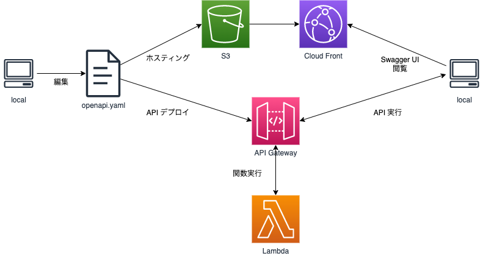

# 環境構築

## 事前準備

1. Node.js(10.13.0 以降)、npm or yarn がインストールされていることを確認。

    ```
    node --version
    npm --version
    yarn --version
    ```

2. [AWS CDK CLI](https://aws.amazon.com/jp/getting-started/guides/setup-cdk/module-two/) をインストール。

    ```
    npm install -g aws-cdk
    ```

3. TypeScript をインストール。

    ```
    npm install -g typescript
    ```

4. package.json から各種モジュールをインストール
    ```
    npm install
    ```

## フォルダ構成

```
cdk_apipack
├── .vscode
│   └── settings.json   # vscode の設定ファイル
├── bin
│   └── app.ts  # アプリケーションのエントリポイント
├── stacks                  # 各種 CDK で記載されたテンプレートファイル
│   └── sampleProject_restApi.ts    # アプリケーションのエントリポイント
├── src                 # 各種ソースファイル
│   └── lambdas
│       ├── hello-function.ts
│       └── ・・・
├── openapi                 # OpenAPI の各種ファイル
│   ├── spec
│   │   └── openapi.yaml    #OpenAPI のyamlファイル
│   └── swagger-ui          #Swagger UI のための各種ファイル
│        ├── index.html
│        ├── index.js
│        └── ・・・
├── test                # jestによるインフラテスト用
├── .gitignore          # トラッキング対象外設定ファイル
├── .npmignore
├── cdk.json            # CDKの構成ファイル
├── jest.config.js      # jestによるインフラテスト用
├── package.json
├── README.md
├── .prettierrc.js      # フォーマッタ設定ファイル
├── .eslintrc.js        # リンター設定ファイル
└── tsconfig.json       # TypeScriptのコンパイル設定
```



## 各スタックについて

stacks フォルダ配下に格納されている、テンプレートのデプロイは target 単位で管理される。

## 実行コマンド

### Cfn テンプレート生成

```
cdk synth -c attrphase={ STAGE } -c target={ TARGET }
```

-   AWS CDK のコードを合成し、 `CloudFormation`テンプレートとして書き出す。
-   書き出された CFn テンプレートは `cdk.out `ディレクトリに出力される。

    -   この時、引数として以下の２点を指定する。
        -   attrphase：デプロイ環境 dev, stg, prd の内いずれかを指定。（リソースのプレフィックスとなる）
        -   target：デプロイするリソースの種類を指定。
            それぞれの引数は以下の通り。

    | 引数 | 内容                           | 主な対象リソース                           |
    | :--- | :----------------------------- | :----------------------------------------- |
    | app  | アプリケーションの為のリソース | CloudFront, S3, API Gateway, Lambda etc... |

### スタックの差分比較

```
cdk diff --profile { プロファイル名 } -c attrphase={ STAGE } -c target={ TARGET }
```

-   デプロイされているスタックと、ローカルを比較。
-   対象のアカウントのプロファイルを指定する必要あり。

### スタックのデプロイ

```
cdk deploy --profile { プロファイル名 } --require-approval never -c attrphase={ STAGE } -c target={ target } --all
```

-   作成されたスタックをデプロイ。
-   `--require-approval never`オプションを指定することで承認確認をスキップ可能。
-   `--all`オプションは、デプロイ対象スタックが複数ある際に指定必須。（単一スタックの場合は指定不要）
